# Product Recommendation System : BigBasket Products Datasets


## **Project Overview**
Rekomendasi produk telah menjadi bagian penting dalam dunia e-commerce. Platform seperti Amazon, Tokopedia, dan BigBasket memanfaatkan sistem rekomendasi untuk meningkatkan pengalaman pengguna dan mendorong konversi penjualan. Dalam konteks ini, proyek ini bertujuan membangun sistem rekomendasi berbasis data produk dari BigBasket, sebuah platform belanja daring populer di India.

Dengan lebih dari 27.000 produk dalam dataset, tantangan yang dihadapi meliputi identifikasi produk serupa dan pemahaman preferensi pengguna, bahkan tanpa data interaksi eksplisit dari pengguna sesungguhnya. Proyek ini penting untuk memberikan wawasan praktis tentang implementasi sistem rekomendasi Content-Based Filtering (CBF) yaitu menyediakan rekomendasi berdasarkan kesamaan konten produk.


## **Business Understanding**
**Problem Statements**<br>
- Bagaimana cara merekomendasikan produk yang mirip dengan produk yang sedang dilihat oleh pengguna?


**Goals**<br>
- Mengembangkan sistem rekomendasi CBF: Berdasarkan atribut produk seperti `category`, `sub_category`, `brand`, dan `type`.

- Menyajikan top-N recommendation yang akurat dan relevan.


**Solution Approach**<br>
- Content-Based Filtering (CBF): Menggunakan fitur produk seperti `category`, `sub_category`, `brand`, dan `type`.

- Mengubah fitur menjadi representasi TF-IDF.

- Menghitung kesamaan antar produk menggunakan cosine similarity.


## **Data Understanding**

Dataset yang digunakan berasal dari [Kaggle - BigBasket Entire Product List](https://www.kaggle.com/datasets/surajjha101/bigbasket-entire-product-list-28k-datapoints) yang terdiri dari 27555 baris dan 10 kolom dengan detail sebagai berikut : 

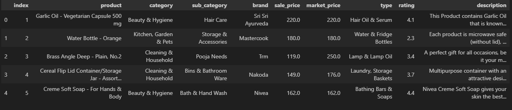

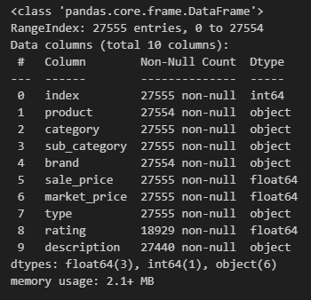

Berikut deskripsi singkat dari masing-masing kolom dalam dataset :


| Nama Kolom      | Deskripsi                                                                 |
|------------------|--------------------------------------------------------------------------|
| `index`          | Nomor indeks baris pada dataset, hanya sebagai penanda urutan data.      |
| `product`        | Nama atau judul dari produk sebagaimana tercantum di situs BigBasket.     |
| `category`       | Kategori utama produk, seperti "Beauty & Hygiene", "Foodgrains", dll.     |
| `sub_category`   | Sub-kategori dari produk yang lebih spesifik dari kategori utama.         |
| `brand`          | Merek atau nama brand dari produk, seperti "Fresho", "bb Royal", dll.     |
| `sale_price`     | Harga jual produk di situs BigBasket (harga setelah diskon).              |
| `market_price`   | Harga pasar normal produk sebelum diskon.                                 |
| `type`           | Jenis atau bentuk produk, seperti "Oil", "Serum", "Tablet", dll.          |
| `rating`         | Nilai rating dari pengguna, dalam skala 1 sampai 5.                       |
| `description`    | Deskripsi lengkap produk yang menjelaskan manfaat dan informasi lainnya.|

Informasi umum dataset :

- Jumlah total baris: 27.555
- Jumlah total kolom: 10
- Detail kolom:
    - nama kolom : `index`, `product`, `category`, `sub_category`, `brand`, `sale_price`, `market_price`, `type`, `rating`, `description`.
    - Jumlah nilai non-null bervariasi, misalnya kolom rating memiliki 18.929 nilai non-null, sedangkan product dan brand masing-masing memiliki 27.554 non-null.
- Tipe data kolom:
    - object: `product`, `category`, `sub_category`, `brand`, `type`, `description`
    - int64: `index`
    - float64: `sale_price`, `market_price`, `rating`
- Data duplikat: tidak ditemukan
- Missing values: ditemukan missing values pada kolom product (1 baris), brand (1 baris), rating (8.626 baris), dan description (115 baris).

### **Exploratory Data Analysis (EDA)**:

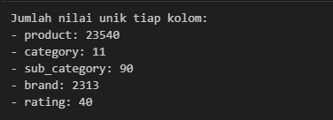

Banyaknya produk dan brand menunjukkan keragaman konten produk yang sangat tinggi, cocok untuk digunakan dalam sistem rekomendasi berbasis konten (CBF). Rating yang beragam memberi potensi untuk analisis kualitas dan preferensi produk. Distribusi kategori dan sub-kategori dapat digunakan untuk mengelompokkan produk yang serupa.


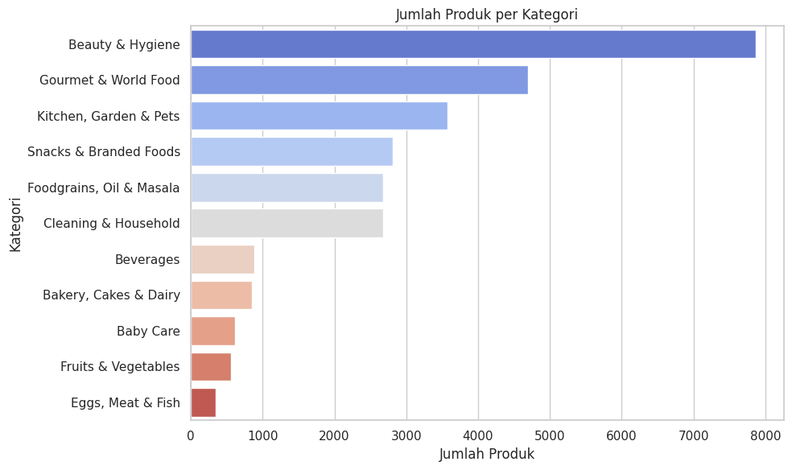

Kategori **Beauty & Hygiene** memiliki jumlah produk terbanyak (7.867), diikuti oleh **Gourmet & World Food** (4.690) dan **Kitchen, Garden & Pets** (3.580). Sementara itu, kategori seperti **Eggs, Meat & Fish** memiliki jumlah produk paling sedikit (350). Informasi ini membantu memahami distribusi produk dan fokus utama platform, serta mengidentifikasi kategori potensial untuk rekomendasi atau pengembangan lebih lanjut.


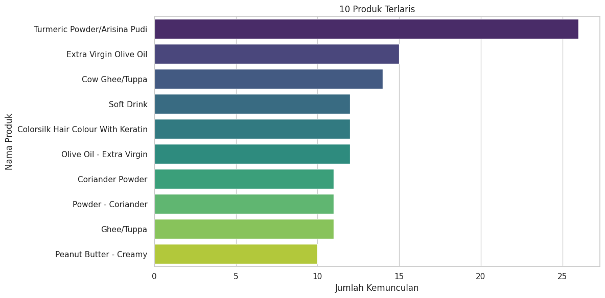

10 produk paling populer dalam dataset, yang dapat dijadikan dasar untuk rekomendasi berbasis popularitas. Hasilnya menunjukkan bahwa produk seperti Turmeric Powder, Extra Virgin Olive Oil, dan Cow Ghee adalah yang paling sering muncul, sehingga bisa dianggap sebagai produk terlaris. Analisis ini membantu memahami tren popularitas dan bisa digunakan sebagai dasar rekomendasi populer.


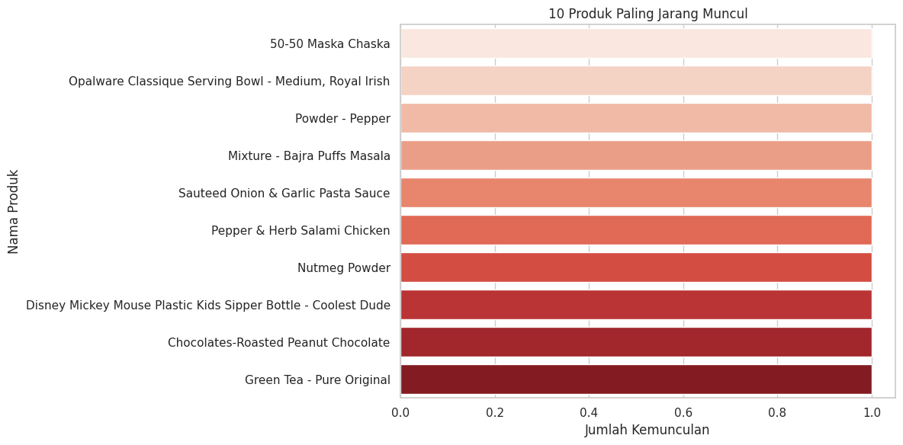

Menampilkan 10 produk dengan kemunculan paling sedikit dalam dataset. Produk-produk ini dianggap kurang populer atau jarang dibeli, sehingga informasi ini dapat membantu mengidentifikasi produk niche atau yang memerlukan strategi pemasaran khusus.

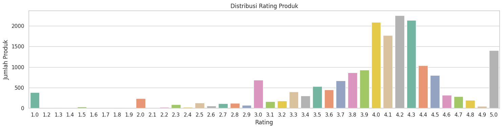

Distribusi rating produk menunjukkan bahwa sebagian besar produk mendapat nilai rating di kisaran 3.0 hingga 4.5, dengan puncak tertinggi pada rating 4.2 (2.251 produk) dan 4.3 (2.140 produk). Rating sangat rendah (di bawah 2.0) dan sangat tinggi (5.0) relatif lebih sedikit, menandakan mayoritas produk mendapatkan penilaian yang cukup baik dan tersebar merata di rentang menengah hingga tinggi.

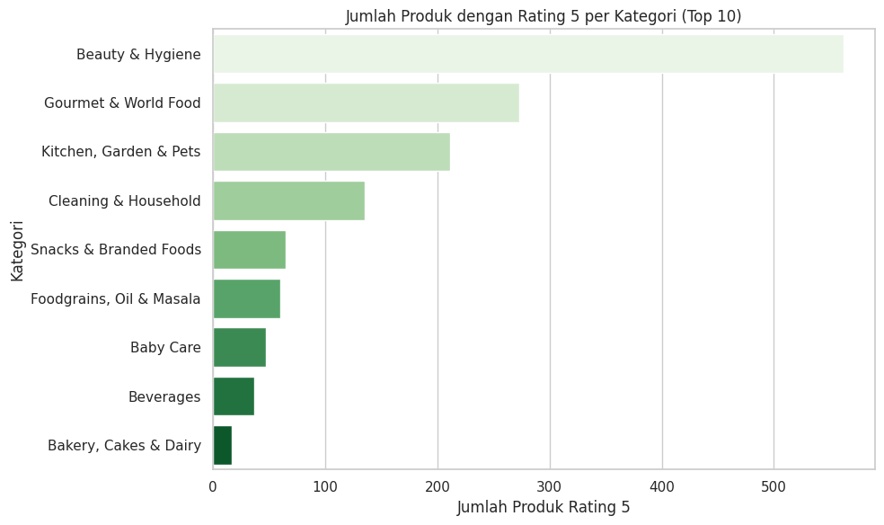

10 kategori dengan jumlah produk yang mendapatkan rating tertinggi (nilai 5) terbanyak. Kategori *Beauty & Hygiene* mendominasi dengan 562 produk, diikuti oleh *Gourmet & World Food* dan *Kitchen, Garden & Pets*. Informasi ini membantu mengidentifikasi kategori dengan produk berkualitas unggulan berdasarkan penilaian pengguna.

## **Data Preparation**

Proses data preparation ini dilakukan untuk membersihkan, menyempurnakan, dan mempersiapkan dataset sebelum digunakan dalam sistem rekomendasi berbasis Content-Based Filtering (CBF). Tahapan dilakukan secara berurutan sebagai berikut:

**1. Hapus Duplikasi dan Kolom Tidak Relevan**
```sh
data_clean = df.copy()
data_clean.drop(columns='index', inplace=True)
data_clean.drop_duplicates(inplace=True)
```
- Dataset disalin agar data asli tetap terjaga.
- Duplikasi data dihapus agar tidak terjadi bias model.
- Kolom index yang tidak memberikan informasi penting dihapus.


**2. Pembersihan dan Transformasi Kolom Kategorikal**
```sh
def split_multivalue(teks):
    return re.split(r"&|,|\*|\n", teks) if isinstance(teks, str) else []

def bersihkan_text(teks):
    if isinstance(teks, list):
        return [t.strip().lower().replace(" ", "") for t in teks]
    elif isinstance(teks, str):
        return teks.strip().lower().replace(" ", "")
    return ''

for kolom in ['category', 'sub_category', 'type']:
    data_clean[kolom] = data_clean[kolom].apply(split_multivalue).apply(bersihkan_text)
data_clean['brand'] = data_clean['brand'].apply(bersihkan_text)
```
- Membersihkan teks dengan mengubah huruf kecil dan menghapus spasi.
- Mengubah string multikategori menjadi list agar cocok untuk pemodelan berbasis teks (CBF).

**4. Persiapan Data untuk Content-Based Filtering (CBF)**

- Fitur gabungan (category, sub_category, type, brand) disiapkan sebagai input vectorisasi teks dengan TF-IDF.

- Penggabungan Fitur: Semua atribut product digabungkan ke dalam kolom fitur_gabungan.

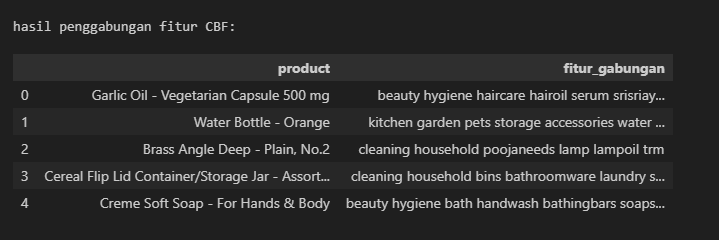

- Duplikasi berdasarkan nama produk dihapus agar model hanya memproses satu representasi unik dari tiap produk. Langkah ini penting untuk mencegah bias model akibat pengulangan deskripsi produk.

```sh
cbf_unique = cbf_data.drop_duplicates(subset='product', keep='first').reset_index(drop=True)
```

- Ekstraksi Fitur Teks: Kolom tersebut diproses menggunakan TF-IDF Vectorizer untuk mendapatkan representasi numerik.


Dari hasil TF-IDF Vectorizer menghasilkan : 
```sh
Ukuran TF-IDF matrix: (23541, 3039)
```


**Alasan Dilakukan Data Preparation**
- Menghindari data redundan dan inkonsistensi.
- Menjamin kualitas input untuk model rekomendasi.
- Menyesuaikan format data sesuai kebutuhan algoritma CBF.

## **Modeling and Result**

Dalam tahap ini, dilakukan pembangunan dan evaluasi sistem rekomendasi untuk menyelesaikan permasalahan pencarian produk yang relevan bagi pengguna. pendekatan algoritma digunakan Content-Based Filtering (CBF).Pendekatan CBF merekomendasikan produk yang mirip secara konten dengan produk yang pernah dilihat atau diminati pengguna. Dalam hal ini, sistem memanfaatkan atribut produk seperti `category`, `sub_category`, `brand`, dan `type`.

**Langkah-langkah:**
- Perhitungan Similaritas: Matriks cosine similarity dihitung dari hasil TF-IDF. menghasilkan cosine_similarity matrix berikut : 

```sh
Ukuran cosine similarity matrix: (23541, 23541)
```
-  Mendefinisikan fungsi `rekomendasi_produk()` yang menghasilkan 10 produk paling mirip dengan produk input berdasarkan cosine similarity dari fitur gabungan (hasil TF-IDF). dari salah satu produk yang dipilih secara acak didapatkan Top 10 rekomendasi produk seperti berikut :

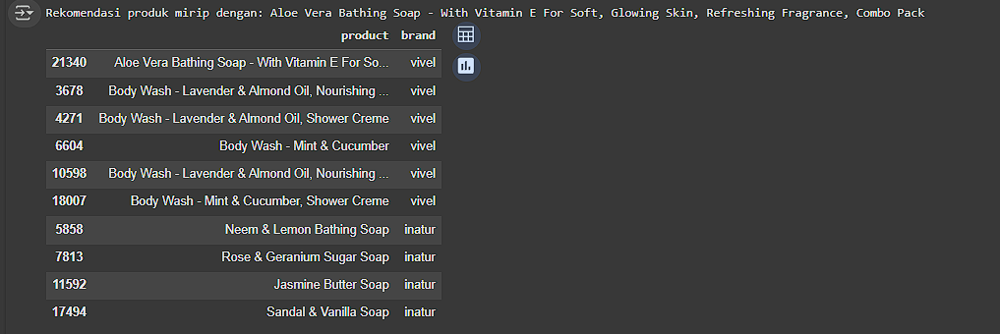

**Kelebihan**
- Tidak membutuhkan data interaksi pengguna (bisa digunakan meskipun user baru).
- Transparan, karena rekomendasi berdasarkan atribut produk yang jelas.

**Kekurangan**
- Tidak mempertimbangkan selera atau perilaku pengguna.
- Rentan terhadap keterbatasan variasi konten (kurang personal).


**Kesimpulan**

**CBF** cocok untuk menemukan produk-produk serupa secara konten, sangat berguna saat pengguna menyukai satu produk dan ingin alternatif yang mirip. Dengan kata lain CBF sangat berguna untuk produk baru atau pengguna baru (cold start user).

## **Evaluation**

Evaluasi dilakukan untuk mengukur seberapa baik sistem rekomendasi dalam memberikan hasil yang relevan dan akurat. Untuk pendekatan Content-Based Filtering, digunakan dua metrik utama:

**Precision@K**

Precision@10 mengukur sejauh mana rekomendasi yang diberikan benar-benar relevan, yaitu apakah produk-produk yang direkomendasikan berada dalam kategori yang sama dengan produk input.

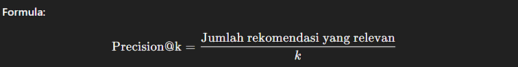

```sh
Precision@10: 0.9988
```

Nilai yang sangat tinggi ini menunjukkan bahwa hampir seluruh produk yang direkomendasikan sangat relevan secara konten terhadap produk asalnya.

**Coverage**

Coverage mengukur jangkauan sistem dalam memberikan rekomendasi, yaitu proporsi produk unik yang dapat direkomendasikan dibandingkan dengan seluruh produk dalam dataset.

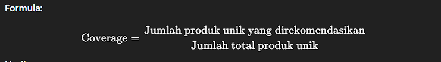

```sh
Coverage: 0.6901
```

Artinya, sekitar 69% dari total produk berhasil direkomendasikan oleh sistem, menunjukkan bahwa sistem memiliki cakupan yang cukup luas dan tidak hanya berfokus pada sebagian kecil produk.


**Kesimpulan Evaluasi**

| Metode | Metrik        | Hasil   | Interpretasi             |
|--------|---------------|---------|--------------------------|
| CBF    | Precision@10  | 0.9988  | Relevansi sangat tinggi  |
| CBF    | Coverage      | 0.6901  | Cakupan luas dalam item  |

Evaluasi ini menunjukkan bahwa CBF sangat andal untuk rekomendasi berdasarkan kesamaan konten produk.
